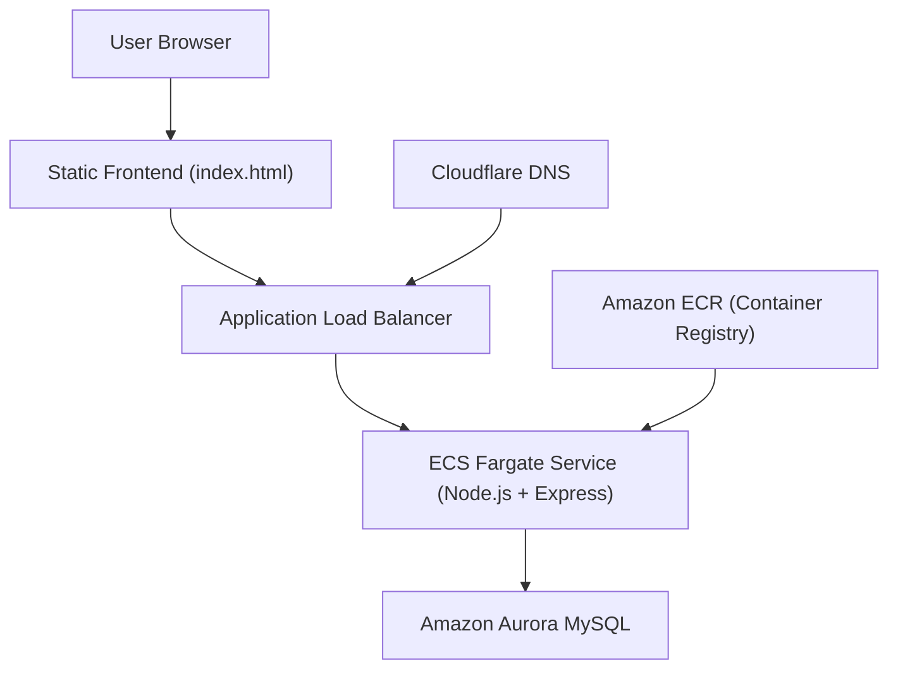
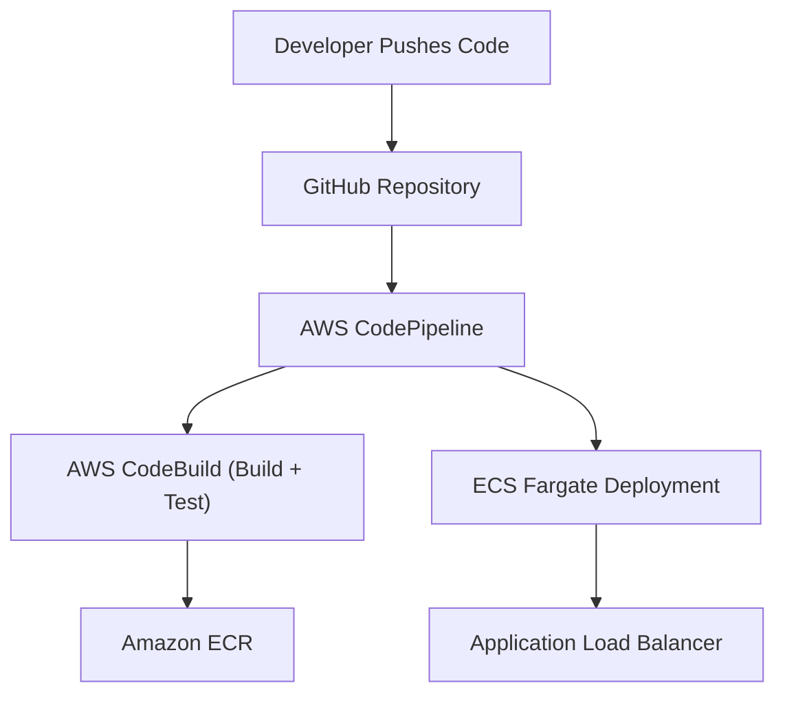

# Todo App

A simple cloud-hosted Todo application with a lightweight frontend and a fully containerized backend, designed as a playground for cloud infrastructure, CI/CD, and AWS services.

---

## 💡 Overview

This project provides basic todo functionality with a minimal static frontend and a backend API service.  
The primary focus of the project is reliable backend design, deployment automation, and cloud infrastructure learning.

---

## 🏗️ Architecture

**Core Components**
- Backend: Node.js, Express
- Database: Amazon Aurora (MySQL compatible)
- Containerization: Docker / OCI image stored in Amazon ECR
- Deployment: Amazon ECS Fargate
- Load Balancing: Application Load Balancer (ALB)
- CI/CD: AWS CodePipeline + CodeBuild
- DNS: Cloudflare

**Flow**
1. Code is pushed to repository  
2. CI builds backend image and pushes it to ECR  
3. CodePipeline deploys to ECS Fargate  
4. ALB routes traffic to running tasks  
5. Database persists application data  

---

## 🚀 Features
- Create and manage todos
- RESTful API backend
- Cloud-native deployment
- Fully automated CI/CD pipeline
- Production-style networking setup
- Uses ALB health checks and stateless containers for safe redeployments

---

## 🧑‍💻 Local Development

### Prerequisites
- Node.js  
- npm  
- Docker (if you want to mirror container behavior)
- MySQL or a local equivalent (if testing DB locally)
- Nix (optional)

### Setup
1. Clone the GitHub repository, and navigate into it.
2. Run `npm install`
3. Rename `.env.example` to `.env` (and look at [Environment](#environment))
4. For developing, run `npx nodemon`
5. For production, 
```
docker build -t todo-app .
docker run -p 3000:3000 --env-file .env todo-app
```


## Environment
All the variables from `.env` are documented here -
- DB_HOST - IP address of system hosting the database (MySQL or any compatible one)
- DB_NAME - Name of database where todos are to be written into
- DB_USER - Username of user accessing the database
- DB_PASSWORD - Password for user

All the above variables are **required**

Some other optional environment variables are -
- JWT_SECRET - Secret to be used for the JSON Web Token
- DEV_MODE - Whether to enable verbose logging (off, by default)
- PORT - Port number on which backend runs (3000, by default)

## API Documentation

### Auth
POST /signup  
Body:
```json
{
    "email": "test@gmail.com",
    "password": "test.com"
}
```
POST /login  
Body:
```json
{
    "email": "test@gmail.com",
    "password": "test.com"
}
```
POST /logout  
No body

### Todos
POST /todos/create  
Body: 
```json
{
    "note": "note 1",
    "completed": 1
}
```
POST /todos/modify/:id  
Body:
```json
{
    "id": 1,
    "note": "Test",
    "completed": 1
}
```
DELETE /todos/delete/:id  
GET /todos/list  
GET /todos/:id  

Note: Updates use POST /todos/modify/:id instead of PUT/PATCH to simplify handler structure and reduce development effort. This was a conscious design choice for a learning project.

## Architecture Diagram



## CI/CD Flow



## Design Choices
- Amazon ECR was used instead of a third-party Docker registry for tighter integration with AWS IAM and ECS.
- ECS Fargate was chosen over EC2 to avoid instance management and simplify container orchestration for a stateless backend.
- An Application Load Balancer (ALB) was used to route traffic to running ECS tasks and perform health checks.
- Aurora MySQL was selected to use a managed relational database with automated backups and scaling, without manual database administration.

## Reproducibility & Infrastructure Lifecycle
- Infrastructure was intentionally provisioned and later decommissioned as part of cost-aware cloud usage.
- The application backend is stateless and containerized, enabling clean redeployments.
- CI/CD pipelines and container images are defined to support repeatable deployments.

## Cost Considerations
- Infrastructure was sized conservatively and decommissioned when not in use to avoid unnecessary cloud spend.

## Limitations
- Basic UI/UX
- No performance or scalability testing
- Vendor lock-in to AWS
- No uptime guarantees
- No rate limiting
- No IaC for easy redeployment (yet)

## Status
This application was previously deployed end-to-end on AWS using ECS Fargate, ALB, and Aurora MySQL.

The infrastructure was intentionally decommissioned to manage AWS usage costs and credits.  
The system is designed to be stateless and reproducible, and can be redeployed using the existing source code and configuration when required.

Licensed under MIT, 2025.